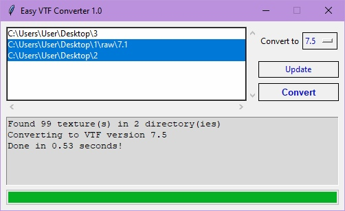

# Easy-VTF-Converter
Software for comfortable conversion of VTF images  

VTF versions supported: **7.0-7.5**  
OS supported: currently only **Windows**  

Converting VTF images wasn't as easy before  
### Quick Start  
1. Open folder with images you want to convert  
2. Click **Update** button, so folder path would appear in white box  
3. Choose all folder paths you want to be processed  
4. Choose version you want them to be converted to  
5. Click **Convert**  
