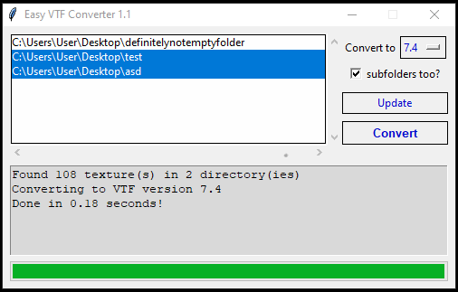

# Easy-VTF-Converter
Software for comfortable conversion of VTF images  

VTF versions supported: **7.0-7.5**  
OS supported: currently only **Windows**  



Converting VTF images wasn't as easy before  
### Quick Start  
1. Open folder with images you want to convert  
2. Click **Update** button, so folder path would appear in white box  
3. Choose all folder paths you want to be processed  
4. Choose version you want them to be converted to  
5. Click **Convert**

### Building
Install dependencies `pip install -r requirements.txt` and run `python buildexe.py`  
You will then find **VTFChanger.exe** inside _dist_ folder

### Testing
For pytest to work properly, link current project as module package `pip install -e .`  
Tests rely on VTFCmd.exe for validation, so you will have to install it if you haven't already (it comes with VTFEdit),
can be downloaded here https://github.com/NeilJed/VTFLib/releases  
Replace VTFCMD_path value with absolute path to the VTFCmd.exe in **.../tests/test_main.py:23**
```python
self.VTFCMD_path = '<vtfcmd.exe absolute path here>'
```
Then you can run `pytest` or `py.test` for executing tests
